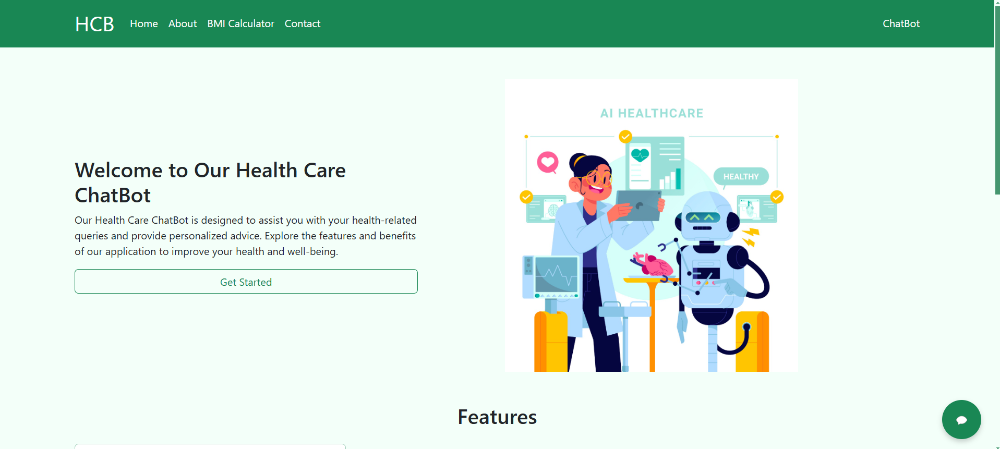
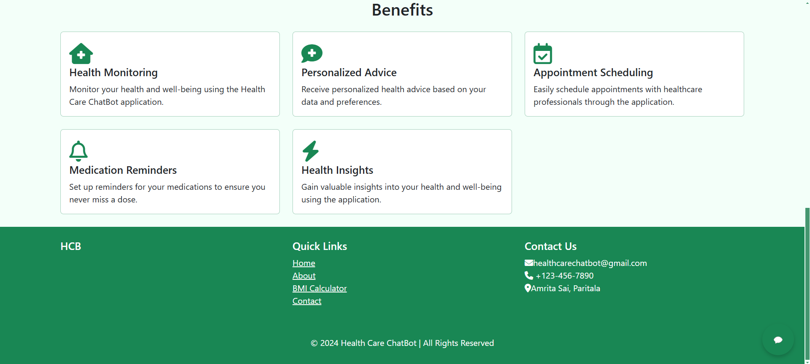
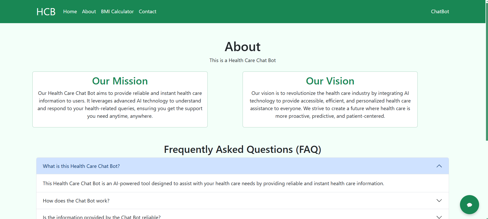
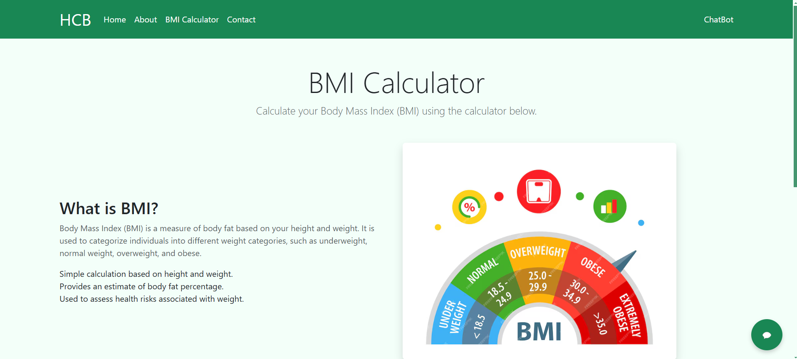
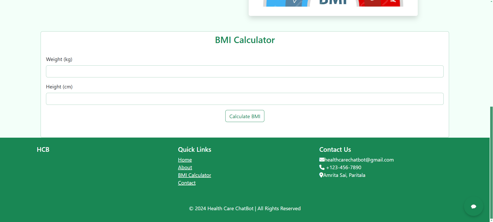
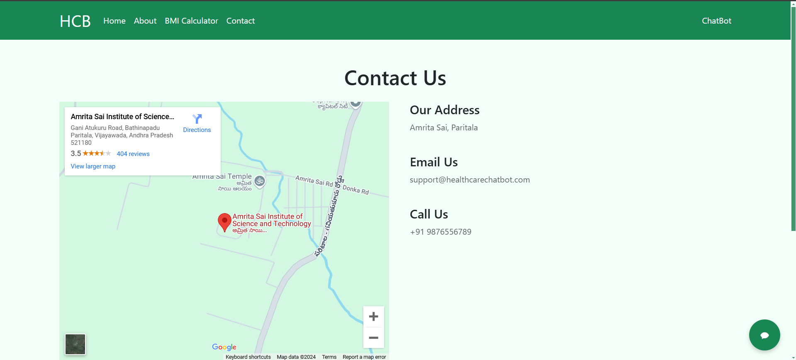
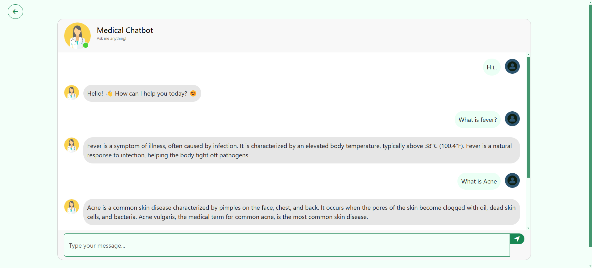

## Introduction

This is a Medical Chat Bot made using Generative AI and it was trained on the book The GALE ENCYCLOPEDIA of MEDICINE. For the front end, I have used Flask, a Python framework, and for the database, I have used Pinecone vector BD. The LLM is used for processing the query and the ranked results from the knowledge base. This also includes some basic utilities like a BMI calculator.

## SetUp
1. Clone the repository
    ```bash
    git clone
    ```

2. Create a virtual environment
    ```bash
    python -m venv venv
    ```
3. Activate the virtual environment
    ```bash
    .\env\bin\activate
    ```

4. Install the required packages
    ```bash
    pip install -r requirements.txt
    ```

5. Set the environment variables
    ```bash
    GOOGLE_API_KEY=<GOOGLE_API_KEY>
    PINECONE_API_KEY=<YOUR_PINECONE_API_KEY>
    ```
    Replace
    - `<GOOGLE_API_KEY>` with your Google API Key
    - `<YOUR_PINECONE_API_KEY>` with your Pinecone API Key

6. Run the app
    ```bash
    python app.py
    ```

## Contribution
1. Fork the repository
2. Clone the repository
    ```bash
    git clone
    ```
3. Create a new branch
    ```bash
    git checkout -b <branch-name>
    ```
4. Make the changes
5. Commit the changes
    ```bash
    git commit -m "<message>"
    ```
6. Push the changes
    ```bash
    git push origin <branch-name>
    ```
7. Create a pull request

## License
This project is licensed under the MIT License - see the [LICENSE](LICENSE) file for details.

## Preview

### Home





### About



### BMI Calculator





### Contact


### Healt Care Chatbot


### Preview Video of the Health Care Chatbot made using Generative AI
[Preview Video](preview/HealthCareChatBot.mp4)

## Contact
For any queries, feel free to contact me at [pavankumargarapati04@gmail.com](mailto:pavankumargarapati04@gmail.com)
